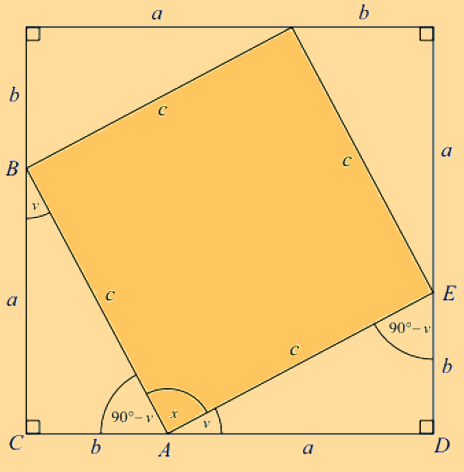

# Pythagora's Theorem

---

Pythagora's theorem for dummies. <a href="../../../Home.html">(~/)</a>

Pythagoras Theorem states that the relationship between the three sides \\( a \\), \\( b \\), and \\( c \\) in a right-angled triangle is as follows:

\\[ a^{2} + b^{2} = c^{2} \\]

This square has sidelengths \\( a + b \\) and a right-angled triangle in every corner. The hypotenuses, all with sidelengths c, of those triangles, then, produces a smaller square inside the original.

The area of each of the four triangles are \\( \frac{1}{2} \cdot a \cdot b \\). Since the bigger square's area equals the sum of the areas of the smaller square and the four triangles, you get:

\\[
(a + b)^{2} = 
c^{2} + 4 \cdot \frac{1}{2} \cdot a \cdot b
\\]

Expanding and reducing the equation produces the following:

\\[
a^{2} + b^{2} + 2ab =
c^{2} + 2ab
\\]

Lastly, subtracting \\( 2ab \\) yields the Pythagorean Theorem:

\[ a^{2} + b^{2} + c^{2} \]

