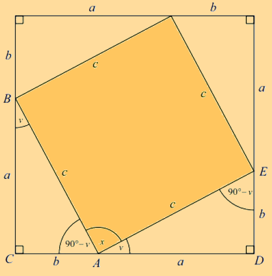

# Pythagoras Theorem

---

Pythagoras theorem for dummies. <a href="../../Home.html">(../)</a>

Pythagoras Theorem states that the relationship between the three sides \\( a \\), \\( b \\), and \\( c \\) in a right-angled triangle is as follows:

\\[ a^{2} + b^{2} = c^{2} \\]

_NOTE: Finish this_

